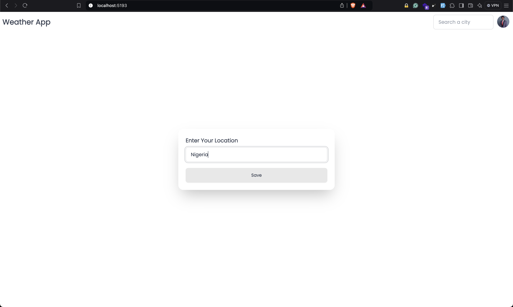
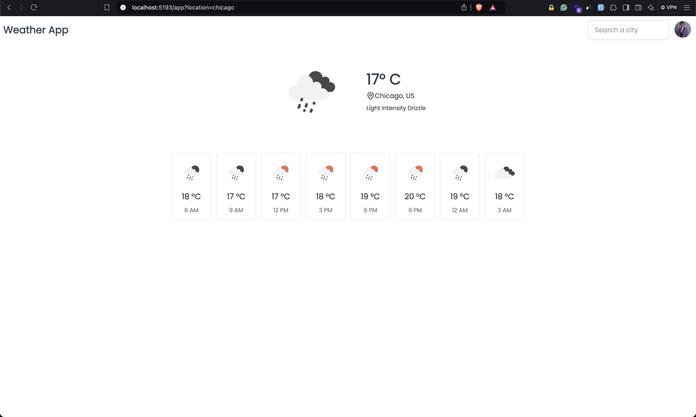
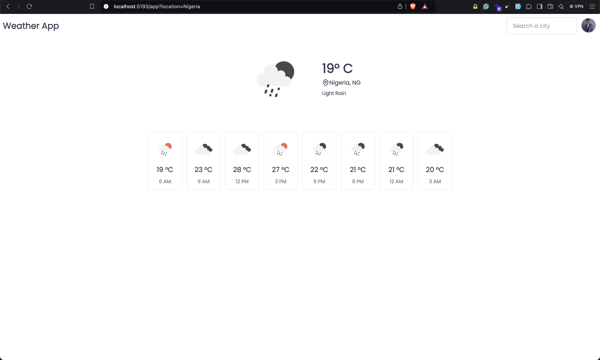
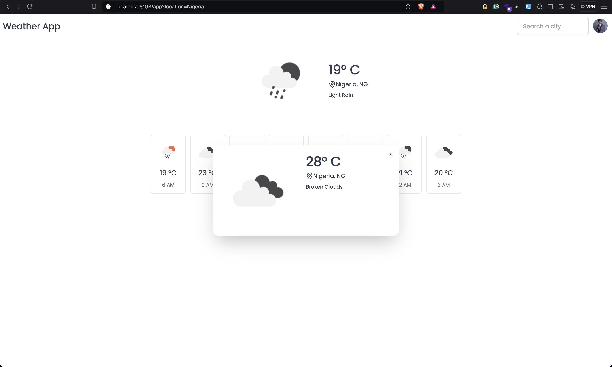

# Blazor Web App 🚀

This is a simple Blazor Web App that uses the OpenWeatherMap API to get the current weather of a country, city or location. I built this app to learn the Blazor framework and to practice my C# skills.

## Technologies Used 🔧

1. Blazor
2. C#
3. Tailwindcss and Daisy UI
4. OpenWeatherMap API

## Resouces

Below are the 2 major resouces I used to learn Blazor before building this app. If you've the funds to pay for Julio's course, I highly recommend it. They are solid.

1. Microsoft Blazor Docs <https://learn.microsoft.com/en-us/aspnet/core/blazor/?view=aspnetcore-8.0&WT.mc_id=dotnet-35129-website>
2. Blazor Crash Course By Julio Casal <https://www.youtube.com/watch?v=RBVIclt4sOo>

## Images

Project images.

## Setup

To setup this project.

1. Clone this repository.
2. Run npm install.
3. Run dotnet restore
4. Make sure you also start the tailwindcss cli by running npm run tailwind
5. Run the project by running dotnet watch

## About Me

I'm Adedoyin Emmanuel Adeniyi, a Software Engineer. I'm currently learning C#, Dotnet, DSA and Design Patterns. I love playing CODM in my free time. You can connect with me on [Twitter](https://x.com/Emmysoft_Tm) and [LinkedIn](https://www.linkedin.com/in/adedoyin-emmanuel/).
